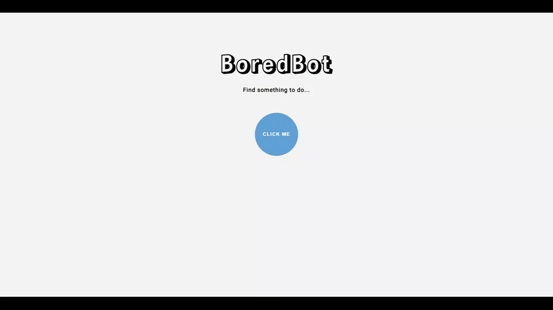

# UnBoredMe

UnBoredMe is a simple and intuitive web application designed to combat boredom by providing users with exciting and engaging activity ideas. The app leverages the power of the Borebot API to generate unique and entertaining suggestions whenever you're feeling bored.

## Table of contents

- [Overview](#overview)
  - [Description](#description)
  - [Demo](#demo)
  - [Links](#links)
- [Built with](#built-with)
- [Installation](#installation)
- [Author](#author)

## Overview

### Description

UnBoredMe is a user-friendly web application. With just a single tap, the app connects to the Borebot API and generates unique activity ideas across various categories. Whether you're looking for a creative outlet, an adventure, a relaxing experience, or an opportunity to learn something new, UnBoredMe has got you covered.

The app's intuitive interface and streamlined functionality make it effortless to find inspiration and break free from the monotony of boredom.

### Demo

### Links

- Solution URL: [GitHub](https://github.com/fatima-xs/unboredme-app)
- Live Site URL: [Netlify](https://unboredme-app-fatima.netlify.app/)

## Built with

- HTML
- CSS
- Vanilla JS
- Borebot API: An external API that provides activity suggestions

## Installation

- Clone this repository to your desktop
- Navigate to the top level of the directory
- Open ./index.html in your browser

## Author

### Fatimata Ndiaye

- [Profile](https://github.com/fatima-xs "Fatima Ndiaye")
- [Email](mailto:fatimanndiaye@gmail.com?subject=Hi "Hi!")
